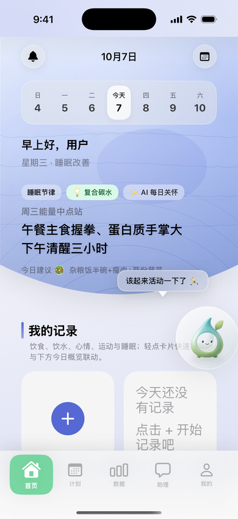
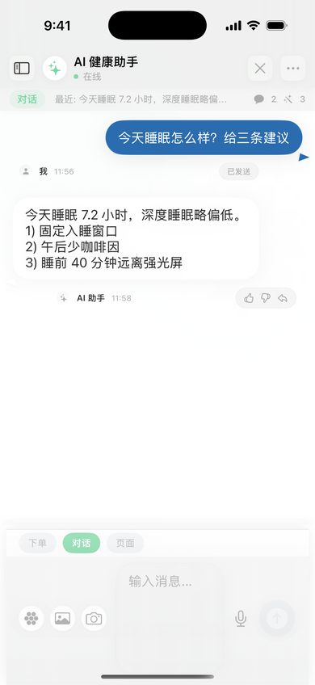
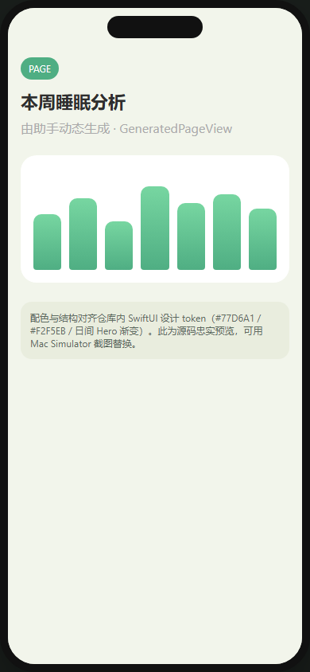
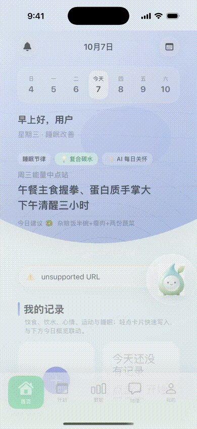
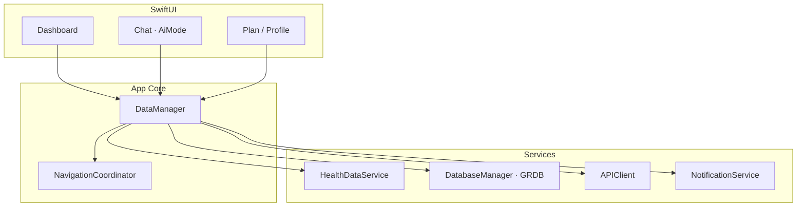

<p align="center">
  
</p>

<p align="center">
  <a href="LICENSE"></a>
  
  
  
</p>

<p align="center"><b>AegisFlow</b> — AI 原生健康管理 iOS App：Dashboard 聚合 HealthKit，助手用自然语言完成查数据、下单、看定制页。</p>

<p align="center">
  <a href="#核心能力">核心能力</a> ·
  <a href="#快速开始">快速开始</a> ·
  <a href="#架构">架构</a> ·
  <a href="CONTRIBUTING.md">贡献</a>
</p>

---

## 为什么做这个

健康 App 常见问题是：**数据多、入口散、任务要点很多按钮**。  
AegisFlow 把高频操作收到助手里，用三种交互模式覆盖不同意图：

| 模式 | 用户在说什么 | 产品怎么应 |
| --- | --- | --- |
| **CHAT** | 问答、健康咨询 | 消息气泡、快捷建议、语音输入 |
| **ORDER** | 「帮我点外卖」 | 对话触发 WebView 下单流程 |
| **PAGE** | 「给我看本周睡眠分析」 | 动态生成页面（`GeneratedPageView`） |

仪表盘侧用 HealthKit 同步步数、心率、睡眠等指标，配合计划、记录与个人中心，形成可运行的原生 SwiftUI 产品原型。

## 界面预览

| Dashboard | Chat · 三模式 | PAGE 生成页 |
| :---: | :---: | :---: |
|  |  |  |

<p align="center">
  
</p>

录屏（Simulator）：[docs/media/walkthrough.mp4](docs/media/walkthrough.mp4)

> 目标为 **iOS Simulator 实机截图/录屏**（GitHub Actions `macos-15` + `simctl`，DEBUG `-uiDemo`）。  
> 若图仍是旧的 HTML 预览，触发 Actions：**Simulator Screenshots**，或本地 Mac 运行 `Scripts/capture-simulator-ui.sh`。

---

## 核心能力

- **HealthKit 仪表盘** — 指标聚合、趋势与洞察入口  
- **AI 三模式助手** — `CHAT` / `ORDER` / `PAGE` 可切换  
- **运动与习惯** — 计划、微运动、习惯养成  
- **记录** — 饮食 / 饮水 / 心情 / 运动 / 睡眠等  
- **个人中心** — 资料、设备、设置、本地通知  
- **数据层** — GRDB 本地库、Keychain Token、URLSession API 客户端  

---

## 快速开始

### 环境

- macOS + Xcode 15+（建议）
- iOS 16.0+ 模拟器或真机  
- 可选：后端 API（见 `docs/AEGIS_API_DRAFT.md`）；无后端时可验证 UI / 本地数据 / HealthKit 权限流  

### 打开工程

```bash
git clone https://github.com/Xinyu-Cui111/AegisFlow.git
cd AegisFlow
open AegisFlow.xcodeproj
```

1. 选择 Scheme：`AegisFlow`  
2. 目标设备：iOS 16+ Simulator  
3. Run（⌘R）  

DEBUG 可用启动参数 `-forceLogin` 清本地登录态，方便反复测登录 / Onboarding。

### 试玩包（可选）

仓库含未签名 IPA：[`Artifacts/AegisFlow-unsigned.ipa`](Artifacts/AegisFlow-unsigned.ipa)  
仅供有签名能力的开发者侧载验证，**不是** App Store 包。

---

## 架构



```
AppMain.swift           入口 · APNs · 根路由
GlobalManager/          Tab · DataManager · NavigationCoordinator
Modules/                Dashboard · Chat · Plan · Profile · …
Services/               API · GRDB · HealthKit · Storage · Notification
ShareComponents/        主题色 · 空态/加载 · 通用控件
docs/                   API 草案 · 媒体资源说明
Artifacts/              未签名 IPA（可选）
```

| 组件 | 技术 |
| --- | --- |
| UI | SwiftUI |
| 语言 | Swift 5.9+ |
| 最低系统 | iOS 16.0 |
| 本地库 | GRDB.swift |
| 网络 | URLSession |
| 健康数据 | HealthKit |
| 安全存储 | Keychain + UserDefaults |

主题色：Sage `#A7CDB8` / `#A5D23D`，Teal Deep `#306E6F`；仪表盘支持按星期切换日间主题。

---

## 开发提示

**新页面：** 在 `Modules/` 建模块 → `XXXView` + `ViewModel` → 在 `MainTabView` / `NavigationCoordinator` 挂路由。

**主题色：**

```swift
let theme = Color.weekThemeColor(for: dayOfWeek)
Color.sageBright
Color.tealDeep
```

**持久化：** `PreferencesStorage` / `TokenStorage`（Keychain）/ `DatabaseManager`。

更细的 API 说明见 [docs/AEGIS_API_DRAFT.md](docs/AEGIS_API_DRAFT.md)。

---

## 路线图

- [x] SwiftUI 主框架与 Tab 导航  
- [x] AI 三模式（CHAT / ORDER / PAGE）  
- [x] HealthKit 同步与 GRDB 本地读写  
- [x] 公开界面预览图 / 短动图（见 `docs/media/`；可用 Simulator 实拍替换）  
- [ ] 单元测试与关键 UI 测试  
- [ ] App Store 图标、隐私政策与提交流程  

---

## 参与贡献

见 [CONTRIBUTING.md](CONTRIBUTING.md)。Issue / PR 欢迎。

## 许可证

[MIT](LICENSE) © Xinyu-Cui111
